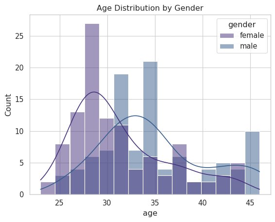
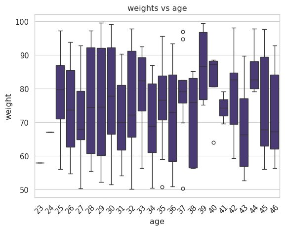
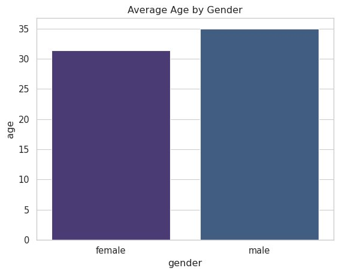
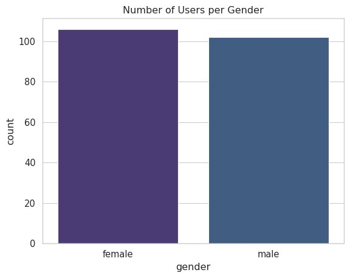
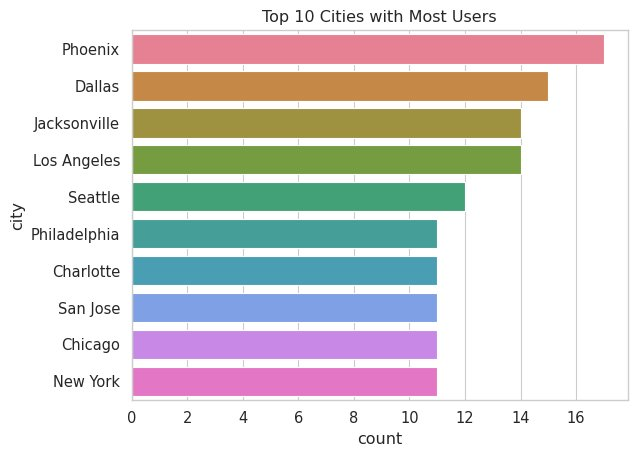
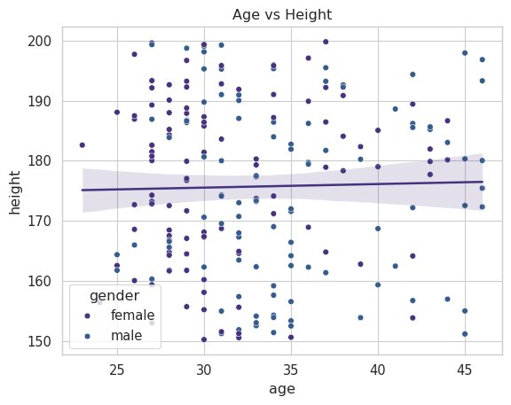
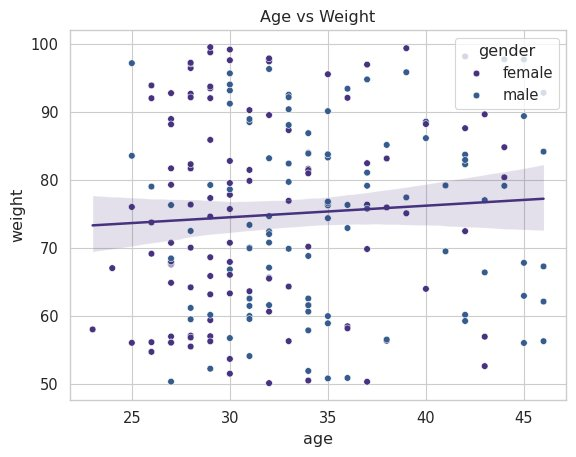

# 📊 DummyJSON Users — Exploratory Data Analysis

> A comprehensive visual analysis of user demographics, geographic distribution, and physical attributes sourced from the [DummyJSON REST API](https://dummyjson.com/users).

---

## 🛠️ Tech Stack

| Tool | Purpose |
|------|---------|
| `requests` | Fetch data from DummyJSON API |
| `pandas` | Data cleaning & transformation |
| `seaborn` | Statistical visualisations |
| `matplotlib` | Plot rendering & saving |

---

## 📋 Dataset Overview

| Metric | Value |
|--------|-------|
| Total Users | 207 |
| Female Users | 105 |
| Male Users | 102 |
| Average Age | ~33 years |
| Average Height | ~175 cm |
| Top City | Phoenix (17 users) |
| Source | `https://dummyjson.com/users` |

---

## 🔄 Data Pipeline

```python
import requests
import pandas as pd
import seaborn as sns
import matplotlib.pyplot as plt

# Paginate through all users
total, skip, limit, pages = 0, 0, 100, []
while True:
    r    = requests.get(f'https://dummyjson.com/users?limit={limit}&skip={skip}')
    data = r.json()
    pages.append(pd.DataFrame(data['users']))
    total = data['total']
    skip += limit
    if skip >= total: break

df = pd.concat(pages)

# Extract nested address fields
df['city']    = df['address'].apply(lambda x: x['city'])
df['country'] = df['address'].apply(lambda x: x['country'])

# Drop unused columns
df.drop(columns=['id', 'username', 'birthDate', 'image',
                 'address', 'bank', 'company', ...], inplace=True)
df.drop_duplicates(inplace=True)

# Set global Seaborn theme
sns.set_style("whitegrid")
sns.set_context("paper", font_scale=1.2)
sns.set_palette("viridis")
```

---

## 📈 Visualisations

### 1. Age Distribution by Gender
> `sns.histplot` + KDE



Most users fall between **ages 25–35**. Female users skew slightly younger. KDE curves reveal a bimodal pattern in male ages.

---

### 2. Weight vs Age
> `sns.boxplot`



Weight distributions per age group show **no strong linear trend**, with most medians clustered between 70–85 kg across all ages.

---

### 3. Average Age by Gender
> `sns.barplot`



Males average **~35 years** vs females at **~31.5 years** — a ~3.5 year gap in the dataset.

---

### 4. Number of Users per Gender
> `sns.countplot`



Gender distribution is nearly balanced: **105 female** vs **102 male** users — a 51/49 split.

---

### 5. Top 10 Cities with Most Users
> `sns.barplot` (horizontal)



**Phoenix** leads with 17 users, followed by Dallas (15) and Jacksonville / Los Angeles (14 each). The top 10 cities span both coasts and the Sun Belt.

---

### 6. Age vs Height
> `sns.scatterplot` + `sns.regplot`



Nearly flat regression line confirms **no meaningful correlation** between age and height (r ≈ 0). Gender clustering is clearly visible.

---

### 7. Age vs Weight
> `sns.scatterplot` + `sns.regplot`



A slight positive trend (r ≈ 0.15) suggests weight increases marginally with age, but the effect is weak — scatter dominates.

---

## 🔍 Key Findings

1. **Age is concentrated in the 25–35 range** — Both genders peak in their late 20s, with males showing a secondary cluster around 35–40.
2. **Gender split is nearly 50/50** — 105 female vs 102 male; the dataset is well-balanced with no significant sampling skew.
3. **Phoenix dominates geographically** — The top 10 is dominated by large Sun Belt and coastal metros.
4. **No meaningful age–height relationship (r ≈ 0)** — Height is driven by gender, not age. The regression line is essentially flat.
5. **Weak positive age–weight correlation** — A marginal upward trend exists, but variance is high and the effect is not clinically significant.

---

## 📁 Project Structure

```
├── README.md
├── Untitled5.ipynb               # Main analysis notebook
├── chart_age_distribution.png
├── chart_weight_vs_age.png
├── chart_avg_age_gender.png
├── chart_users_per_gender.png
├── chart_top10_cities.png
├── chart_age_vs_height.png
└── chart_age_vs_weight.png
```

---

*Data source: [https://dummyjson.com/users](https://dummyjson.com/users)*
